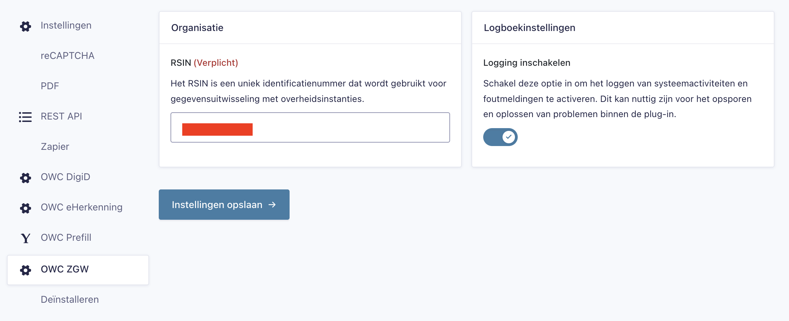
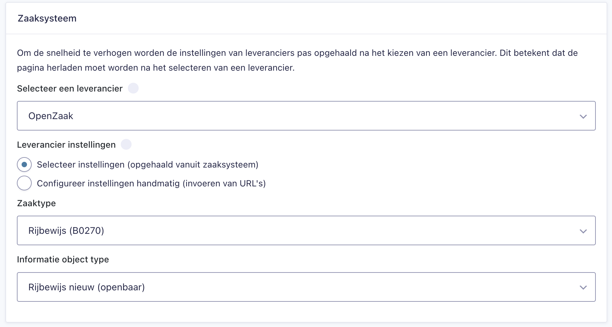
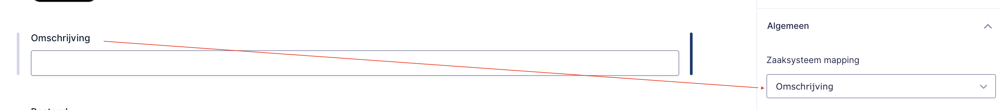
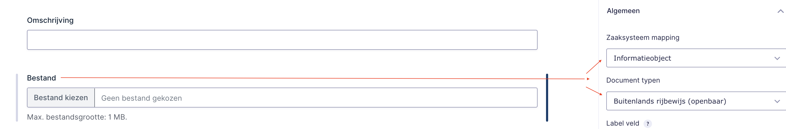
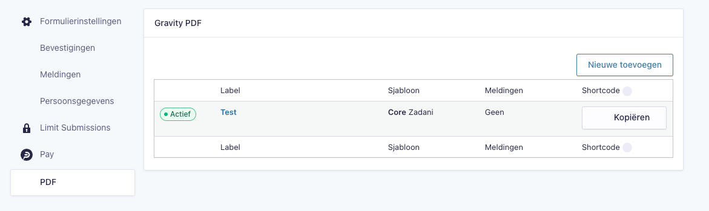

# OWC GravityForms ZGW

> [!WARNING]
> This plugin is under development, do not use in production environments.

This plugin connects GravityForms with ZGW by using the owc/zgw-api package.
In order for the connection(s) to work the ZGW registers must be configured on the settings page (/wp-admin/options-general.php?page=zgw_api_settings).

Read the documentation of the owc/zgw-api package on [how to get started](https://github.com/OpenWebconcept/owc-zgw-api/tree/main/docs)

## 📄 GravityForms Implementation

When this plugin is activated, it adds functionality to configure a form for creating a **zaak**, uploading **documents** to that zaak, and appending a **submission PDF**.

---

## General settings (GravityForms Add-on)

In the **GravityForms** settings page, navigate to the **"OWC ZGW"** tab.
This section allows you to configure general settings that apply to **all forms connected to ZGW**.

#### Organization

A **RSIN number** is required for creating a **zaak**.
Make sure to fill this out correctly as it is used in all zaak creation requests.

#### Logging

Enable logging to keep track of errors during communication with the ZGW supplier(s).
Errors will be written to the file: `owc-zgw-log.json` — located in the root of the plugin folder.



---

## ⚙️ Form Settings

On the **Form Settings** page, scroll down to find the section titled **"Zaaksysteem"**.
This section contains all the required settings for each form.

### Step-by-step Configuration

1. **Select a supplier** (e.g., Decos).
2. **Choose how to configure supplier-specific settings**:
   - **Option A: Dynamically**
     - Select a **Zaak type**.
     - Select an **Information Object Type** related to the chosen Zaak type. (used for the submission PDF)
   - **Option B: Manually**
     - Enter the **Zaak Type URL** from the supplier’s catalog.
     - Enter the **Information Object Type URL** from the same catalog. (used for the submission PDF)

✅ Once this configuration is complete, you can begin **mapping form fields** to ZGW fields via each field’s settings.



---

## 🧩 Configure a Form

Each form field needs to be **mapped** to a ZGW field.

### Regular Fields (e.g., text, date)

Use the dropdown labeled **"Zaaksysteem mapping"** in the field settings to map the form field to a ZGW property.

- These fields are used to create the **zaak** and set **zaak eigenschappen** (case properties).
- At minimum, you must map one field to the ZGW field **"omschrijving"** (description).
- Other required fields will be auto-filled from plugin general and specific form settings.

**Regular Field Mapping:**



### Upload Fields

1. Use **"Zaaksysteem mapping"** to map the field to **"informatieobject"**.
2. Use the second dropdown **"Document typen"** to link a **document type** to the upload field.

**Upload Field Mapping:**



### Submission PDF

After a successful form submission, a **PDF** is generated using the **Gravity PDF** plugin.
This PDF contains the full submission and is automatically uploaded and attached to the corresponding **zaak** in the **ZGW register**.

> ⚠️ For this to work, you must configure an **"Information Object Type"** in the form settings.



---

## Disabling SSL verification in local environments

The plugin disables SSL peer verification only when the environment value contains 'dev' (at the bare minimum).
To enable this behavior, you need to define the WP_ENVIRONMENT_TYPE constant in your wp-config.php.

```php
define( 'WP_ENVIRONMENT_TYPE', 'development' );
```

Local environments often lack valid SSL certificates, which can cause file_get_contents() or other HTTP requests to fail due to peer verification errors.
This configuration ensures smoother development without compromising production security.
